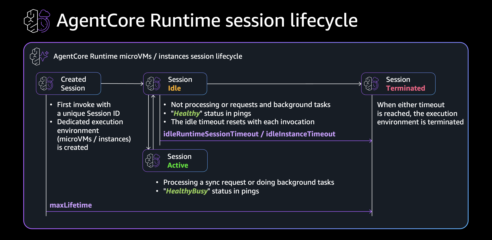

# Amazon Bedrock AgentCore Runtime: 非同期 / 長時間実行エージェントのサンプル実装

Amazon Bedrock AgentCore Runtime で 15 分の Request timeout を超える長時間処理を実現するサンプルコードです。`add_async_task()` / `complete_async_task()` による HealthyBusy 制御の有無で、セッションのライフサイクルがどう変わるかを 3 パターンで示します。



解説記事: [Amazon Bedrock AgentCore Runtime で実現する 非同期 / 長期実行エージェント](https://zenn.dev/ykbone/articles/agentcore-async-long-running-patterns)

## 構成

```
.
├── pattern-a-healthy-only/     対照実験: /ping が常に Healthy を返す (セッションは idle timeout で terminate)
│   └── main.py
├── pattern-b-healthy-busy/     推奨パターン: add_async_task で HealthyBusy を制御 (セッション維持)
│   └── main.py
├── pattern-c-strands-agent/    実践パターン: Strands Agents + HealthyBusy
│   ├── main.py
│   └── Dockerfile
├── Dockerfile                  共通 Dockerfile (pattern-a, pattern-b 用)
├── invoke.py                   invoke ヘルパースクリプト
└── images/
    └── session_lifecycle.png   セッションライフサイクル図
```

| パターン | HealthyBusy | 結果 |
|---------|-------------|------|
| A | なし | `idleRuntimeSessionTimeout` でセッション terminate |
| B | あり | `maxLifetime` まで処理が継続 |
| C | あり + Strands Agent | AI エージェントの長時間 tool 呼び出しに対応 |

## 前提条件

- AWS CLI v2 (`aws bedrock-agentcore-control` サブコマンドが利用可能なバージョン)
- Python 3.13+ / boto3
- Docker (ARM64 ビルド用に `docker buildx`)
- ECR リポジトリ (事前作成)

## ビルド & ECR push

```bash
# ECR ログイン
aws ecr get-login-password --region us-west-2 \
  | docker login --username AWS --password-stdin <account-id>.dkr.ecr.us-west-2.amazonaws.com

# pattern-a
cd pattern-a-healthy-only
docker buildx build --platform linux/arm64 \
  -t <account-id>.dkr.ecr.us-west-2.amazonaws.com/<repository-name>:pattern-a \
  -f ../Dockerfile --push .
cd ..

# pattern-b
cd pattern-b-healthy-busy
docker buildx build --platform linux/arm64 \
  -t <account-id>.dkr.ecr.us-west-2.amazonaws.com/<repository-name>:pattern-b \
  -f ../Dockerfile --push .
cd ..

# pattern-c (専用 Dockerfile)
cd pattern-c-strands-agent
docker buildx build --platform linux/arm64 \
  -t <account-id>.dkr.ecr.us-west-2.amazonaws.com/<repository-name>:pattern-c \
  --push .
cd ..
```

## デプロイ: Runtime microVM

`--capacity-provider-configuration` を指定しないことで Runtime microVM になります。

```bash
ECR=<account-id>.dkr.ecr.us-west-2.amazonaws.com/<repository-name>

# pattern-a (対照実験)
aws bedrock-agentcore-control create-agent-runtime \
  --region us-west-2 \
  --agent-runtime-name "microvm_pattern_a" \
  --role-arn "arn:aws:iam::<account-id>:role/<execution-role>" \
  --agent-runtime-artifact "{\"containerConfiguration\": {\"containerUri\": \"${ECR}:pattern-a\"}}" \
  --protocol-configuration '{"serverProtocol": "HTTP"}' \
  --network-configuration '{"networkMode": "PUBLIC"}' \
  --lifecycle-configuration '{"idleRuntimeSessionTimeout": 1200, "maxLifetime": 28800}'

# pattern-b (推奨)
aws bedrock-agentcore-control create-agent-runtime \
  --region us-west-2 \
  --agent-runtime-name "microvm_pattern_b" \
  --role-arn "arn:aws:iam::<account-id>:role/<execution-role>" \
  --agent-runtime-artifact "{\"containerConfiguration\": {\"containerUri\": \"${ECR}:pattern-b\"}}" \
  --protocol-configuration '{"serverProtocol": "HTTP"}' \
  --network-configuration '{"networkMode": "PUBLIC"}' \
  --lifecycle-configuration '{"idleRuntimeSessionTimeout": 1200, "maxLifetime": 28800}'
```

## デプロイ: Runtime Instances

capacity provider を作成し、その ARN を agent runtime に指定します。

```bash
# 1. capacity provider 作成
aws bedrock-agentcore-control create-capacity-provider \
  --region us-west-2 \
  --name "async_long_running_cp" \
  --permissions-configuration '{"capacityProviderOperatorRoleArn": "arn:aws:iam::<account-id>:role/<operator-role>"}' \
  --compute-configuration '{
    "ec2Configuration": {
      "launchTemplateSource": {
        "launchParameters": {
          "operatingSystem": "LINUX_ARM64",
          "instanceRequirements": {"allowedInstanceTypes": ["c7g.2xlarge"]}
        }
      },
      "vpcConfiguration": {
        "subnets": ["<subnet-id-1>", "<subnet-id-2>", "<subnet-id-3>"],
        "securityGroups": ["<security-group-id>"]
      },
      "lifecycleConfiguration": {"idleInstanceTimeout": 1200, "maxLifetime": 28800}
    }
  }'

# 2. agent runtime 作成 (pattern-b)
aws bedrock-agentcore-control create-agent-runtime \
  --region us-west-2 \
  --agent-runtime-name "instances_pattern_b" \
  --role-arn "arn:aws:iam::<account-id>:role/<execution-role>" \
  --agent-runtime-artifact "{\"containerConfiguration\": {\"containerUri\": \"${ECR}:pattern-b\"}}" \
  --capacity-provider-configuration '{"capacityProviderArn": "<capacity-provider-arn>"}' \
  --protocol-configuration '{"serverProtocol": "HTTP"}' \
  --lifecycle-configuration '{"idleRuntimeSessionTimeout": 1000, "maxLifetime": 28800}'
```

## 検証手順

記事の対照実験を再現する手順です。

### 1. ジョブ開始

```bash
python invoke.py \
  --runtime-arn "arn:aws:bedrock-agentcore:us-west-2:<account-id>:runtime/<runtime-id>" \
  --session-id "longrun-session-min-33-characters-0001" \
  --action start \
  --duration 1300
```

### 2. タスク状態確認 (pattern-b のみ、開始 10 秒後)

```bash
python invoke.py \
  --runtime-arn "..." \
  --session-id "longrun-session-min-33-characters-0001" \
  --action taskinfo
```

`active_count: 1` であれば HealthyBusy に遷移しています。

### 3. セッション生存確認 (1400 秒後)

```bash
sleep 1400

python invoke.py \
  --runtime-arn "..." \
  --session-id "longrun-session-min-33-characters-0001" \
  --action whoami
```

### 期待結果

| パターン | whoami の応答時間 | uptime | 判定 |
|---------|-----------------|--------|------|
| A (Healthy のみ) | 遅い (cold start) | 短い (新しい実行環境) | セッション terminate 済み |
| B (HealthyBusy) | 速い (warm) | ~1400s (同一実行環境) | セッション維持、処理完走 |

## クリーンアップ

```bash
# agent runtime 削除
aws bedrock-agentcore-control delete-agent-runtime \
  --region us-west-2 \
  --agent-runtime-id <runtime-id>

# capacity provider 削除 (Runtime Instances の場合)
aws bedrock-agentcore-control delete-capacity-provider \
  --region us-west-2 \
  --capacity-provider-id <capacity-provider-id>
```

## 参考

- [Handle asynchronous and long running agents with Amazon Bedrock AgentCore Runtime](https://docs.aws.amazon.com/bedrock-agentcore/latest/devguide/runtime-long-run.html)
- [Runtime sessions](https://docs.aws.amazon.com/bedrock-agentcore/latest/devguide/runtime-sessions.html)
- [Quotas for Amazon Bedrock AgentCore](https://docs.aws.amazon.com/bedrock-agentcore/latest/devguide/bedrock-agentcore-limits.html)
- [Get started with Instances using the AWS CLI or SDK](https://docs.aws.amazon.com/bedrock-agentcore/latest/devguide/runtime-instances-get-started-cli.html)
- [bedrock-agentcore-sdk-python (GitHub)](https://github.com/aws/bedrock-agentcore-sdk-python)
