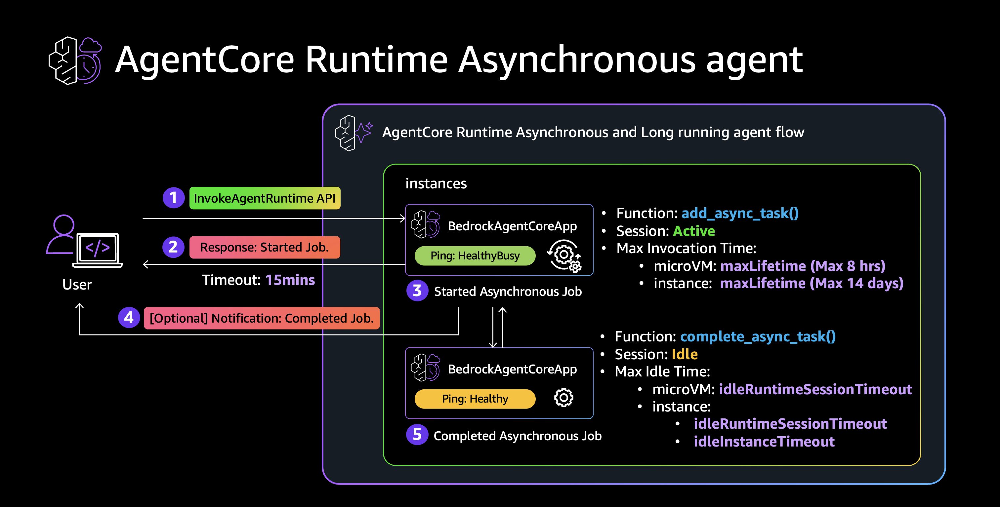

[English](README.md) | Japanese

# Amazon Bedrock AgentCore Runtime: 非同期 / 長時間実行エージェントのサンプル実装

Amazon Bedrock AgentCore Runtime で 15 分の Request timeout を超える長時間処理を実現するサンプルコードです。`add_async_task()` / `complete_async_task()` による HealthyBusy 制御の有無で、セッションのライフサイクルがどう変わるかを 3 パターンで示します。



解説記事: [Amazon Bedrock AgentCore Runtime で実現する 非同期 / 長期実行エージェント](https://zenn.dev/ykbone/articles/agentcore-async-long-running-patterns)

## 構成

```
.
├── pattern-a-healthy-only/     対照実験: /ping が常に Healthy を返す (idle timeout で terminate)
│   ├── main.py
│   └── Dockerfile
├── pattern-b-healthy-busy/     推奨パターン: add_async_task で HealthyBusy を制御 (セッション維持)
│   ├── main.py
│   └── Dockerfile
├── pattern-c-strands-agent/    実践パターン: Strands Agents + HealthyBusy
│   ├── main.py
│   └── Dockerfile
├── invoke.py                   invoke ヘルパースクリプト
├── requirements.txt            invoke.py の依存 (boto3)
└── images/
    └── session_lifecycle.png
```

| パターン | HealthyBusy | 結果 |
|---------|-------------|------|
| A | なし | `idleRuntimeSessionTimeout` でセッション terminate |
| B | あり | `maxLifetime` まで処理が継続 |
| C | あり + Strands Agent | AI エージェントの長時間 tool 呼び出しに対応 |

## 前提条件

> **Note:** Runtime Instances のデプロイコマンド (`create-capacity-provider`、`--capacity-provider-configuration`) は AWS CLI v2 でのみ利用可能です。AWS CLI v1 にはこれらのサブコマンド/オプションが存在しないため、Runtime Instances のデプロイ手順は実行できません。macOS で Homebrew 等により v1 と v2 が共存している場合は、`aws --version` でバージョンを確認してください。本リポジトリの検証は AWS CLI v2.36.23 で実施しています。

- AWS CLI v2 (`aws bedrock-agentcore-control` サブコマンドが利用可能なバージョン)
- Python 3.13+ / pip
- Docker (ARM64 ビルド用に `docker buildx`)
- ECR リポジトリ (事前作成)
- AgentCore Runtime の実行ロール (事前作成)

## セットアップ

```bash
git clone https://github.com/SeongHaedu/amazon-bedrock-agentcore-async-long-running-samples.git
cd amazon-bedrock-agentcore-async-long-running-samples

pip install -r requirements.txt
```

以降のコマンドはすべてリポジトリルートから実行します。

## 環境変数

手順で繰り返し使う値を変数にまとめます。

```bash
export AWS_REGION=us-west-2
export ACCOUNT_ID=<account-id>
export ECR_REPO=$ACCOUNT_ID.dkr.ecr.$AWS_REGION.amazonaws.com/<repository-name>
export EXECUTION_ROLE_ARN=arn:aws:iam::$ACCOUNT_ID:role/<execution-role>
```

## ビルド & ECR push

```bash
# ECR ログイン
aws ecr get-login-password --region $AWS_REGION \
  | docker login --username AWS --password-stdin $ACCOUNT_ID.dkr.ecr.$AWS_REGION.amazonaws.com

# pattern-a
docker buildx build --platform linux/arm64 \
  -t $ECR_REPO:pattern-a \
  --push pattern-a-healthy-only/

# pattern-b
docker buildx build --platform linux/arm64 \
  -t $ECR_REPO:pattern-b \
  --push pattern-b-healthy-busy/

# pattern-c
docker buildx build --platform linux/arm64 \
  -t $ECR_REPO:pattern-c \
  --push pattern-c-strands-agent/
```

## デプロイ: Runtime microVM

`--capacity-provider-configuration` を指定しないことで Runtime microVM になります。

```bash
# pattern-a (対照実験: HealthyBusy なし)
aws bedrock-agentcore-control create-agent-runtime \
  --region $AWS_REGION \
  --agent-runtime-name "microvm_pattern_a" \
  --role-arn "$EXECUTION_ROLE_ARN" \
  --agent-runtime-artifact "{\"containerConfiguration\": {\"containerUri\": \"$ECR_REPO:pattern-a\"}}" \
  --protocol-configuration '{"serverProtocol": "HTTP"}' \
  --network-configuration '{"networkMode": "PUBLIC"}' \
  --lifecycle-configuration '{"idleRuntimeSessionTimeout": 1200, "maxLifetime": 28800}'

# pattern-b (推奨: HealthyBusy あり)
aws bedrock-agentcore-control create-agent-runtime \
  --region $AWS_REGION \
  --agent-runtime-name "microvm_pattern_b" \
  --role-arn "$EXECUTION_ROLE_ARN" \
  --agent-runtime-artifact "{\"containerConfiguration\": {\"containerUri\": \"$ECR_REPO:pattern-b\"}}" \
  --protocol-configuration '{"serverProtocol": "HTTP"}' \
  --network-configuration '{"networkMode": "PUBLIC"}' \
  --lifecycle-configuration '{"idleRuntimeSessionTimeout": 1200, "maxLifetime": 28800}'
```

レスポンスの `agentRuntimeId` を控えます。

```bash
export MICROVM_A_ARN=arn:aws:bedrock-agentcore:$AWS_REGION:$ACCOUNT_ID:runtime/<runtime-id-a>
export MICROVM_B_ARN=arn:aws:bedrock-agentcore:$AWS_REGION:$ACCOUNT_ID:runtime/<runtime-id-b>
```

## デプロイ: Runtime Instances

capacity provider を作成し、その ARN を agent runtime に指定します。

```bash
# 1. capacity provider 作成
aws bedrock-agentcore-control create-capacity-provider \
  --region $AWS_REGION \
  --name "async_long_running_cp" \
  --permissions-configuration "{\"capacityProviderOperatorRoleArn\": \"arn:aws:iam::$ACCOUNT_ID:role/<operator-role>\"}" \
  --compute-configuration '{
    "ec2Configuration": {
      "launchTemplateSource": {
        "launchParameters": {
          "operatingSystem": "LINUX_ARM64",
          "instanceRequirements": {"allowedInstanceTypes": ["c7g.2xlarge"]}
        }
      },
      "vpcConfiguration": {
        "subnets": ["<subnet-id-1>", "<subnet-id-2>", "<subnet-id-3>"],
        "securityGroups": ["<security-group-id>"]
      },
      "lifecycleConfiguration": {"idleInstanceTimeout": 1200, "maxLifetime": 28800}
    }
  }'
```

レスポンスの `capacityProviderArn` を控えます。

```bash
export CAPACITY_PROVIDER_ARN=<capacity-provider-arn>

# 2. pattern-a (対照実験)
aws bedrock-agentcore-control create-agent-runtime \
  --region $AWS_REGION \
  --agent-runtime-name "instances_pattern_a" \
  --role-arn "$EXECUTION_ROLE_ARN" \
  --agent-runtime-artifact "{\"containerConfiguration\": {\"containerUri\": \"$ECR_REPO:pattern-a\"}}" \
  --capacity-provider-configuration "{\"capacityProviderArn\": \"$CAPACITY_PROVIDER_ARN\"}" \
  --protocol-configuration '{"serverProtocol": "HTTP"}' \
  --lifecycle-configuration '{"idleRuntimeSessionTimeout": 1000, "maxLifetime": 28800}'

# 3. pattern-b (推奨)
aws bedrock-agentcore-control create-agent-runtime \
  --region $AWS_REGION \
  --agent-runtime-name "instances_pattern_b" \
  --role-arn "$EXECUTION_ROLE_ARN" \
  --agent-runtime-artifact "{\"containerConfiguration\": {\"containerUri\": \"$ECR_REPO:pattern-b\"}}" \
  --capacity-provider-configuration "{\"capacityProviderArn\": \"$CAPACITY_PROVIDER_ARN\"}" \
  --protocol-configuration '{"serverProtocol": "HTTP"}' \
  --lifecycle-configuration '{"idleRuntimeSessionTimeout": 1000, "maxLifetime": 28800}'
```

```bash
export INST_A_ARN=arn:aws:bedrock-agentcore:$AWS_REGION:$ACCOUNT_ID:runtime/<runtime-id-a>
export INST_B_ARN=arn:aws:bedrock-agentcore:$AWS_REGION:$ACCOUNT_ID:runtime/<runtime-id-b>
```

## 検証: Runtime microVM

処理時間 (1300s) が `idleRuntimeSessionTimeout` (1200s) を超える設定で対照実験を行います。

```bash
# --- pattern-a: HealthyBusy なし ---
# ジョブ開始
python invoke.py \
  --runtime-arn "$MICROVM_A_ARN" \
  --session-id "microvm-pattern-a-session-00000001" \
  --action start \
  --duration 1300

# 1400 秒待機後にセッション生存確認
sleep 1400
python invoke.py \
  --runtime-arn "$MICROVM_A_ARN" \
  --session-id "microvm-pattern-a-session-00000001" \
  --action whoami
# → cold start (uptime が短い) = セッションは terminate されている
```

```bash
# --- pattern-b: HealthyBusy あり ---
# ジョブ開始
python invoke.py \
  --runtime-arn "$MICROVM_B_ARN" \
  --session-id "microvm-pattern-b-session-00000001" \
  --action start \
  --duration 1300

# 10 秒後にタスク状態確認
sleep 10
python invoke.py \
  --runtime-arn "$MICROVM_B_ARN" \
  --session-id "microvm-pattern-b-session-00000001" \
  --action taskinfo
# → active_count: 1 (HealthyBusy 状態)

# 1400 秒待機後にセッション生存確認
sleep 1390
python invoke.py \
  --runtime-arn "$MICROVM_B_ARN" \
  --session-id "microvm-pattern-b-session-00000001" \
  --action whoami
# → warm (uptime ~1400s) = 同一セッションが維持されている
```

### 期待結果 (Runtime microVM)

| パターン | whoami 応答時間 | uptime | 判定 |
|---------|----------------|--------|------|
| A (Healthy のみ) | ~1s (cold start) | ~20s (新 microVM) | 失敗: セッション terminate |
| B (HealthyBusy) | ~0.25s (warm) | ~1430s (同一 microVM) | 成功: 処理完走 |

## 検証: Runtime Instances

処理時間 (1300s) が `idleRuntimeSessionTimeout` (1000s) と `idleInstanceTimeout` (1200s) の両方を超える設定で対照実験を行います。

```bash
# --- pattern-a: HealthyBusy なし ---
python invoke.py \
  --runtime-arn "$INST_A_ARN" \
  --session-id "inst-pattern-a-session-000000001" \
  --action start \
  --duration 1300

sleep 1400
python invoke.py \
  --runtime-arn "$INST_A_ARN" \
  --session-id "inst-pattern-a-session-000000001" \
  --action whoami
# → full cold start (~43s) = セッション + インスタンスが回収されている
```

```bash
# --- pattern-b: HealthyBusy あり ---
python invoke.py \
  --runtime-arn "$INST_B_ARN" \
  --session-id "inst-pattern-b-session-000000001" \
  --action start \
  --duration 1300

sleep 10
python invoke.py \
  --runtime-arn "$INST_B_ARN" \
  --session-id "inst-pattern-b-session-000000001" \
  --action taskinfo
# → active_count: 1

sleep 1390
python invoke.py \
  --runtime-arn "$INST_B_ARN" \
  --session-id "inst-pattern-b-session-000000001" \
  --action whoami
# → warm (~0.6s, uptime ~1447s) = 同一インスタンスで処理完走
```

### 期待結果 (Runtime Instances)

| パターン | whoami 応答時間 | uptime | 判定 |
|---------|----------------|--------|------|
| A (Healthy のみ) | ~43s (full cold start) | ~36s (新インスタンス) | 失敗: セッション + インスタンス回収 |
| B (HealthyBusy) | ~0.6s (warm) | ~1447s (同一インスタンス) | 成功: 処理完走 |

## クリーンアップ

```bash
# Runtime microVM の agent runtime 削除
aws bedrock-agentcore-control delete-agent-runtime \
  --region $AWS_REGION \
  --agent-runtime-id <microvm-runtime-id-a>

aws bedrock-agentcore-control delete-agent-runtime \
  --region $AWS_REGION \
  --agent-runtime-id <microvm-runtime-id-b>

# Runtime Instances の agent runtime 削除
aws bedrock-agentcore-control delete-agent-runtime \
  --region $AWS_REGION \
  --agent-runtime-id <instances-runtime-id-a>

aws bedrock-agentcore-control delete-agent-runtime \
  --region $AWS_REGION \
  --agent-runtime-id <instances-runtime-id-b>

# capacity provider 削除
aws bedrock-agentcore-control delete-capacity-provider \
  --region $AWS_REGION \
  --capacity-provider-id <capacity-provider-id>
```

## 参考

- [Handle asynchronous and long running agents with Amazon Bedrock AgentCore Runtime](https://docs.aws.amazon.com/bedrock-agentcore/latest/devguide/runtime-long-run.html)
- [Runtime sessions](https://docs.aws.amazon.com/bedrock-agentcore/latest/devguide/runtime-sessions.html)
- [Quotas for Amazon Bedrock AgentCore](https://docs.aws.amazon.com/bedrock-agentcore/latest/devguide/bedrock-agentcore-limits.html)
- [Get started with Instances using the AWS CLI or SDK](https://docs.aws.amazon.com/bedrock-agentcore/latest/devguide/runtime-instances-get-started-cli.html)
- [bedrock-agentcore-sdk-python (GitHub)](https://github.com/aws/bedrock-agentcore-sdk-python)
